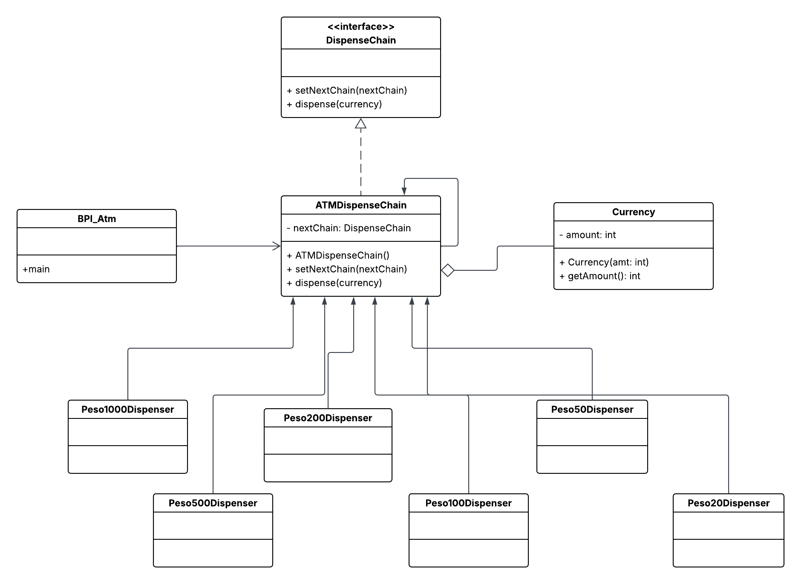

# BPI ATM System - Chain of Responsibility Pattern

## Problem
We will design an ATM system for BPI (Bank of the Philippine Islands) that dispenses cash in denominations of 1000 pesos, 500 pesos, and 100 pesos bills. The system should follow the Chain of Responsibility design pattern to handle the dispensing of cash requests efficiently.

## UML Diagram

In this implementation, ATMDispenseChain class handles the dispensing logic for BPI's ATM system with denominations of 1000, 500, and 100 peso bills. The BPI_Atm class allows users to adjust (hard-coded) an amount and initiates the dispensing process using the Chain of Responsibility pattern.

This design ensures that the ATM system dispenses cash in the specified denominations according to the requested amount.

In the provided example, the elements of the Chain of Responsibility pattern can be identified as follows:

**Handler:** The handler objects are the concrete classes that implement the CurrencyDispenser abstract class. In this case, there are three handlers: Peso1000Dispenser, Peso500Dispenser, and Peso100Dispenser. Each handler is responsible for dispensing a specific denomination of currency.

**Chain:** The chain is represented by the ATMDispenserChain class. It sets up the sequence of handlers by linking them together using the setNextChain() method. The chain is responsible for passing the request along the sequence of handlers until one of them handles it.

**Request:** The request is represented by the dispense() method call made on the first handler in the chain. In this case, the request is to dispense a specific amount of currency.

**Client:** The client is the ATMDispenseChain class that creates and initializes the chain of handlers. It sends the request to the first handler in the chain by calling the dispense() method.

**Context:** The context includes the ATMDispenseChain class, which manages the chain of handlers and ensures that the request is passed along the chain until it is handled.