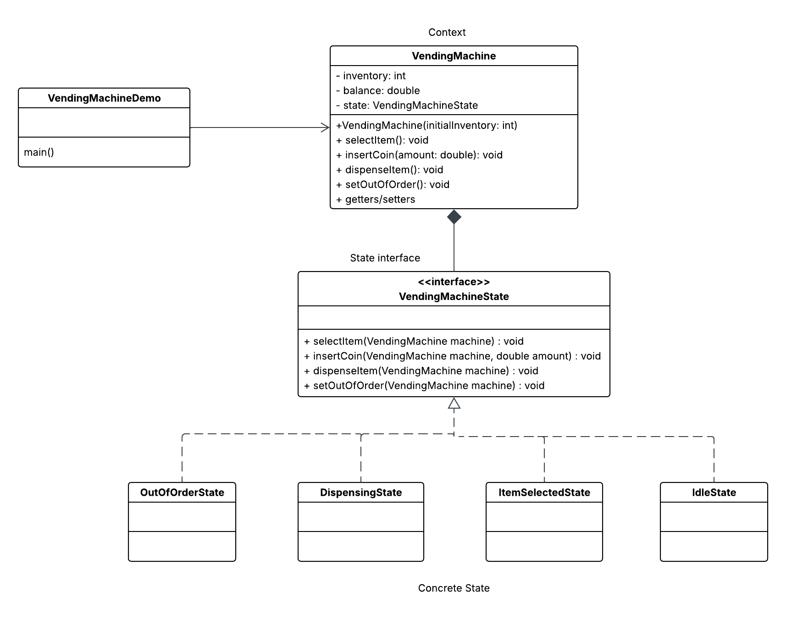

# 🎰 Implementing State Pattern in a Vending Machine Application

## 📌 Problem Scenario

A vending machine needs to manage different states, including "Idle", "ItemSelected", "Dispensing", and "OutOfOrder". Each state has specific rules and restrictions regarding allowed operations, and the vending machine has associated attributes like item inventory and balance.

---

## 🗂️ Requirements

### 💤 Idle State:
Allow item selection.  
Disallow dispensing items and inserting coins.

---

### 🛒 ItemSelected State:
Allow inserting coins and dispensing items.  
Disallow item selection.

---

### 📦 Dispensing State:
Allow no operations.  
Automatically transition back to the "Idle" state after dispensing is complete.

---

### 🚫 OutOfOrder State:
Disallow all operations.

---

## 📊 UML Diagram

---

## ⚠️ Current System

The system currently relies on conditional statements within the VendingMachine class to check the machine state and determine valid actions. This approach becomes cumbersome and error-prone as the number of states and their associated logic grows.

---

## 🏗️ Implement the State Pattern to improve code maintainability and flexibility

### 1️⃣ Define VendingMachine States:
Create separate classes representing different machine states:
- IdleState  
- ItemSelectedState  
- DispensingState  
- OutOfOrderState  

---

### 2️⃣ Implement State Interface:
Define an interface VendingMachineState with methods for common actions like selectItem, insertCoin, dispenseItem, and setOutOfOrder.

---

### 3️⃣ Implement State Behaviors:
Each concrete state class implements the VendingMachineState interface, providing specific behavior for its respective state. For example, the IdleState class would allow item selection, while the OutOfOrderState wouldn't allow any operations.

---

### 4️⃣ Update VendingMachine Class:
Include attributes for item inventory and balance.  
Remove state-specific logic from the VendingMachine class.  
Introduce a reference to the current VendingMachineState object.  
Delegate actions like selectItem, insertCoin, dispenseItem, and setOutOfOrder to the current state object through its corresponding methods.
