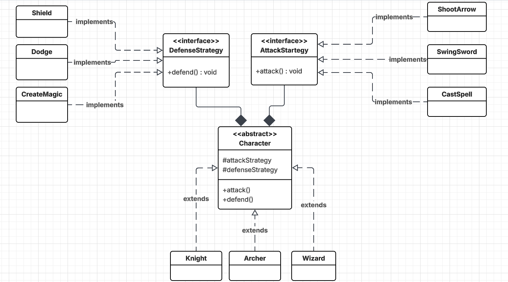

# 🎮 Implementing Strategy Pattern in a Game Application

## 📌 Problem Scenario

You are developing a **GameApp** that features different types of characters, each with unique attack and defense behaviors.

Initially, all behaviors were implemented using conditional logic (`if-else`) inside a single `Character` class. This approach makes the code difficult to extend and violates the **Open/Closed Principle**.

To improve flexibility and maintainability, the system is refactored using the **Strategy Design Pattern**, allowing behaviors to be changed dynamically at runtime.

---

## UML Diagram

---

Problem scenario:

Suppose we have three types of characters in a GameApp:

1. Knight: Attacks with a sword; uses 3 strategies to defend (shield, dodge, magic barrier)
2. Wizard: Casts spells; uses magic barrier to defend
3. Archer: Shoots arrows; uses dodge to to defend

Implement two types of Strategy:
A.  DefenseStrategy
     1. Shield
     2. Dodge
     3. CreateMagic

B.  AttackStrategy
     1.  CastSpell
     2.  ShootArrow
     3.  SwingSword  
